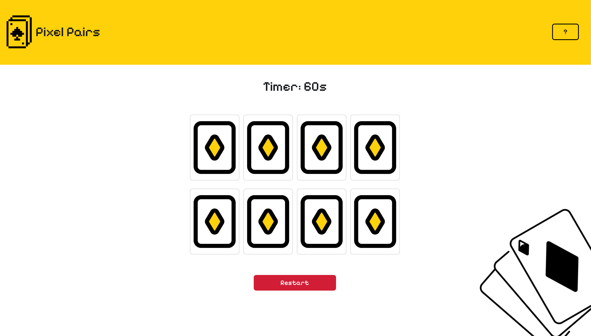

# 🧠💫 Memory Card Game

## 🕹️ Description

This is a classic memory card game built with HTML, CSS, and JavaScript.  
The player flips cards two at a time to find matching pairs.  
The goal is to match all pairs **before the 60-second timer runs out!**

## 🚀 Getting Started

👉 **Play it here:** [https://hadi-3.github.io/memory-card-game/](https://your-memory-game-link.com)

👉 **Planning Materials:**

- [User Stories](https://trello.com/b/S4dMmNEp/project-1)
- [Wireframe](./assets/WireFrame.png)

### How to Play

1. Flip any two cards by clicking on them.
2. If they match, they stay face up.
3. If they don’t match, they flip back after a short delay.
4. Match all pairs before the timer hits 0 to win the game.
5. Click the **Reset** button to restart anytime!

## 💡 Technologies Used

- HTML
- CSS
- JavaScript

## ⏱️ Game Features

- 60-second countdown timer that starts on the first card flip
- Randomized card positions each time
- Win/Lose messages based on performance
- Smooth card flip animations
- Restart button to replay without reloading the page

## 📚 Attributions

- [Pixel Icons](https://www.flaticon.com/) for card images
- [Bootstrap](https://getbootstrap.com) for buttons
- [Google Fonts](https://fonts.google.com/) for pixel-style fonts

## 🚧 Next Steps

- Add sound effects on flip, match, and win/lose
- Make the game more mobile-friendly
- Add difficulty levels (Easy / Medium / Hard)
- Show number of flips or attempts per game
